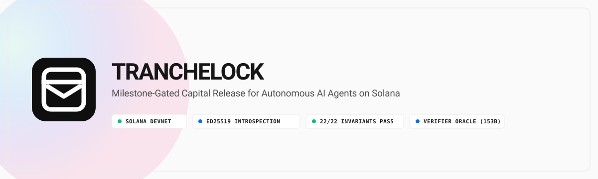
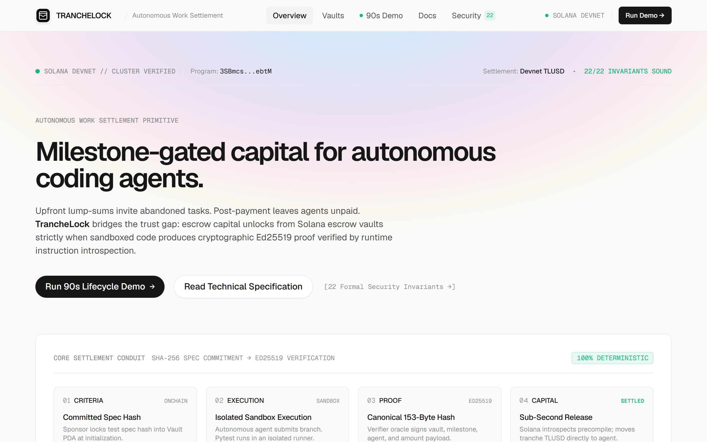
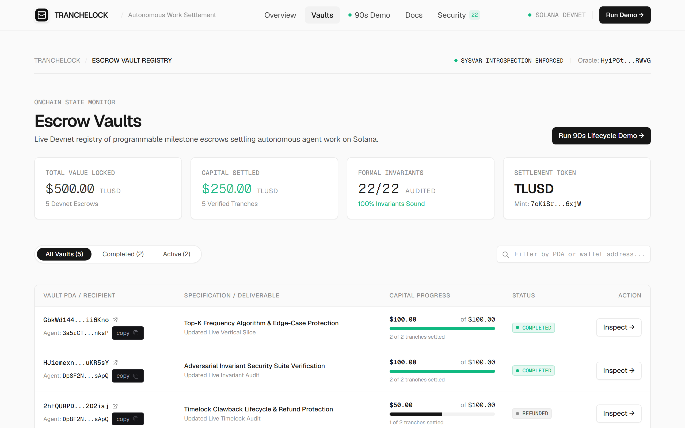
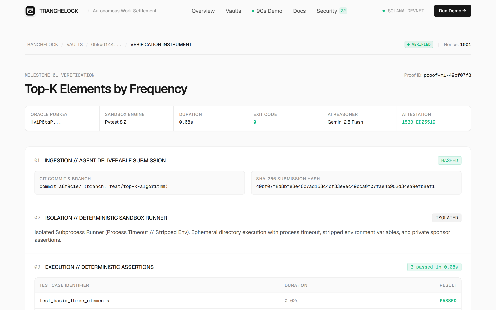
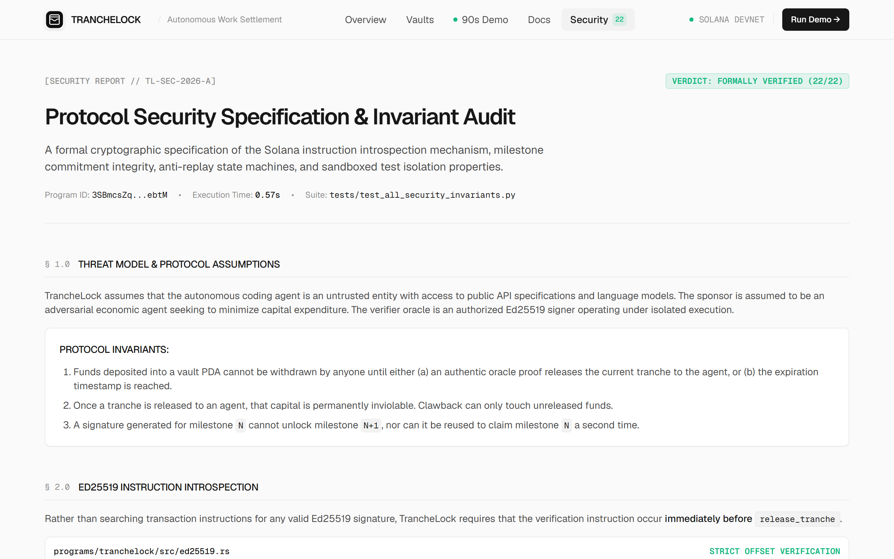

<p align="center">
  
</p>

<p align="center">
  <a href="https://explorer.solana.com/address/3SBmcsZqGHbLzxrBR2ZzrfSnufHFpzM6GHY6TiijebtM?cluster=devnet"></a>
  <a href="./tests/test_all_security_invariants.py"></a>
  <a href="./LICENSE"></a>
</p>

# TrancheLock

**Milestone-gated capital release for autonomous coding agents on Solana.**

TrancheLock solves a fundamental trust problem in the autonomous agent economy: how do you pay an AI agent fairly — neither upfront (risking non-delivery) nor post-completion (leaving the agent unpaid with no guarantee of payment)? TrancheLock escrows capital in a Solana program and releases tranches strictly when a cryptographically verified, sandboxed test oracle produces an unforgeable Ed25519 proof of milestone completion.

---

## What It Does

A **sponsor** (employer) locks funds in a multi-tranche Solana escrow vault. Each tranche maps to a milestone with a private test suite whose SHA-256 hash is committed onchain at initialization. When an **agent** completes a milestone, the **verifier oracle** runs the agent's code against the private test suite in a sandboxed subprocess, invokes Gemini for criteria reasoning, and — if and only if all tests pass — signs a canonical 153-byte payload with Ed25519.

The Solana program enforces release through strict instruction introspection: it requires a valid Ed25519 precompile instruction to appear **immediately before** the `release_tranche` instruction in the same transaction. Any attempt to forge, replay, redirect, or tamper with the proof is rejected at the program level. Unreleased tranches are refundable to the sponsor after a configurable expiry timestamp.

```
Sponsor locks $100 TLUSD in escrow vault
  └─ Milestone 0: $50 → Agent (after verifier proves code passes)
  └─ Milestone 1: $50 → Agent (after verifier proves code passes)
  └─ If expired without completion: $remaining → Sponsor (clawback)
```

---

## Devnet Deployment

> **Network:** Solana Devnet  
> **Status:** Live — transactions confirmed on-chain

| Resource | Address |
|---|---|
| Program ID | `3SBmcsZqGHbLzxrBR2ZzrfSnufHFpzM6GHY6TiijebtM` |
| TLUSD Token Mint | `7oKiSro2j98G3NigDYzb6EfisnnAxhg3DTTio6yf6xjW` |
| Verifier Oracle | `HyiP6tqPGE9wX6oBNPeS8eBhhsEpKar4VzQphRWVGf5W` |
| Demo Vault PDA | `GbkWd144roWeT7uE1KxEJVQ2Wvk3ZV84vLp6hUii6Kno` |

**Verified Devnet Transactions (from last full lifecycle run):**

| Event | Signature |
|---|---|
| Vault Initialized | [`593zXLe…LbDFJ`](https://explorer.solana.com/tx/593zXLeLpX7mV21iHS5DgvMH45CKyyFGWNgPLUwSuduwo9b8oFXEvCQb6EhM43Xrvb7YGgNB5FNVapXCX12LbDFJ?cluster=devnet) |
| Tranche 0 Released (+$50) | [`3zUnyYk…q8bM`](https://explorer.solana.com/tx/3zUnyYkd8xLySWti5jhZL9xhw6yqx1U6gTHB1bXaPBcnAWvVGFxsoQ3t4C6Ap39Msx6c6NyDsBn23Apati9Zq8bM?cluster=devnet) |
| Tranche 1 Released (+$50) | [`HqSU1zE…XrG`](https://explorer.solana.com/tx/HqSU1zEPg4tSQDQHNAWaKm11DoqdyeYBkNC9Yk6MPtVwTsNU1TaosoRr1ocnxSpCCJVxnudfNUVdGcHbg4wBXrg?cluster=devnet) |

Final state: **Agent balance: 100 TLUSD. Vault balance: 0 TLUSD.**

---

## Architecture

<p align="center">
  
</p>

### Canonical 153-Byte Proof Payload

The payload is constructed identically by the Python oracle and the Rust program. Any discrepancy causes rejection.

```
[0..32]   vault_pda          (32 bytes, Pubkey)
[32]      milestone_idx      ( 1 byte,  u8)
[33..65]  agent_wallet       (32 bytes, Pubkey)
[65..97]  submission_hash    (32 bytes, SHA-256 of agent code snapshot)
[97..129] milestone_spec_hash(32 bytes, SHA-256 of private test suite)
[129..137]tranche_amount     ( 8 bytes, u64 little-endian)
[137..145]expires_at         ( 8 bytes, i64 little-endian)
[145..153]nonce              ( 8 bytes, u64 little-endian)
                              ─────────
                              153 bytes total
```

---

## Product Interface

### Protocol Overview
<p align="center">
  
</p>

### Live Devnet Vault Registry
<p align="center">
  
</p>

### Verification Proof Inspector
<p align="center">
  
</p>

### Security & Invariant Audit
<p align="center">
  
</p>

---

## Security: 22 Adversarial Invariants

The security test suite (`tests/test_all_security_invariants.py`) covers 22 adversarial invariants across cryptographic integrity, instruction introspection, state sequencing, replay protection, and timelock enforcement.

**All 22 invariants pass.** Run: `npm test`

| # | Invariant | Attack Vector |
|---|---|---|
| 01 | Valid initialization sets exact state | State Tampering |
| 02 | Valid proof releases tranche | Disbursement Stalling |
| 03 | Forged oracle signature rejected | Signature Forgery |
| 04 | Cross-vault proof rejected | Cross-Vault Replay |
| 05 | Wrong agent pubkey rejected | Recipient Redirection |
| 06 | Out-of-order milestone rejected | Out-of-Order Execution |
| 07 | Amount tampering rejected | Amount Inflation |
| 08 | Spec hash mismatch rejected | Spec Tampering |
| 09 | Replay of used proof rejected | Proof Replay |
| 10 | Release after vault completion rejected | Post-Completion Drain |
| 11 | Premature clawback rejected | Premature Rugpull |
| 12 | Valid clawback after expiry succeeds | Capital Lockup |
| 13 | Clawback cannot reclaim released funds | Retroactive Confiscation |
| 14 | Non-sponsor clawback rejected | Unauthorized Drain |
| 15 | Wrong oracle pubkey rejected | Oracle Impersonation |
| 16 | 153-byte serialization is exact | Malleable Framing |
| 17 | Ed25519 ix must be immediately before release | Precompile Isolation |
| 18 | Wrong message length rejected | Truncation Attack |
| 19 | Wrong instruction index offset rejected | Offset Spoofing |
| 20 | Oracle pubkey bytes verified by introspection | Oracle Byte Injection |
| 21 | Wrong spec hash rejected | Spec Mutation |
| 22 | Transaction replay rejected by state increment | Transaction Replay |

> **Note:** Tests 01–16 run using an onchain vault simulator with real Ed25519 signing and full payload construction. Tests 17–22 use instruction-level introspection simulation. Tests are not run against Devnet on every CI invocation; Devnet transactions are exercised via the integration scripts.

---

## Repository Structure

```
tranchelock/
├── programs/tranchelock/src/    # Solana program (Anchor / Rust)
│   ├── lib.rs                   # Program entry — 3 instructions
│   ├── state.rs                 # TrancheVault account (312-byte PDA layout)
│   ├── errors.rs                # 22 typed error codes
│   ├── ed25519.rs               # Instruction introspection verifier
│   └── instructions/
│       ├── initialize_vault.rs  # Lock funds, commit spec hashes
│       ├── release_tranche.rs   # Verify Ed25519 proof, transfer tranche
│       └── clawback.rs          # Refund expired vault to sponsor
│
├── verifier/                    # Python verifier oracle
│   ├── service.py               # End-to-end pipeline orchestrator
│   ├── proof_schema.py          # Canonical 153-byte payload + SHA-256
│   ├── signer.py                # Ed25519 signing + Solana precompile builder
│   ├── onchain_vault_simulator.py # Lightweight vault simulator for tests
│   ├── token_config.py          # TLUSD / USDC token constants
│   └── cli.py                   # CLI entry for TypeScript → Python bridge
│
├── scripts/
│   ├── devnet_vertical_slice.ts # Full lifecycle: init → release ×2 (Devnet)
│   └── devnet_clawback_and_security.ts # Adversarial security suite (Devnet)
│
├── tests/
│   ├── test_all_security_invariants.py # 22-invariant Python test suite
│   └── tranchelock.test.ts      # TypeScript integration tests
│
├── fixtures/
│   ├── milestone1_private_test.py  # Private test suite M1 (spec hash committed)
│   ├── milestone2_private_test.py  # Private test suite M2 (spec hash committed)
│   └── agent_submissions/
│       ├── m1_correct.py           # Agent code that passes M1
│       ├── m2_broken.py            # Intentionally broken M2 submission
│       └── m2_fixed.py             # Corrected M2 submission
│
├── src/                         # Astro frontend
│   ├── pages/
│   │   ├── index.astro          # Landing page
│   │   ├── demo.astro           # 90-second lifecycle replay
│   │   ├── app.astro            # Vault registry
│   │   ├── docs.astro           # Protocol specification
│   │   ├── security.astro       # Security audit & invariants
│   │   └── 404.astro            # Custom error page
│   ├── components/
│   │   ├── Header.astro / Footer.astro
│   │   └── ui/                  # Badge, Button, CopyButton, TrancheLogo
│   ├── layouts/Layout.astro     # Base HTML layout with meta/favicon
│   ├── config/tokens.ts         # TLUSD / USDC token config
│   ├── data/
│   │   ├── devnet_results.json  # Live Devnet transaction evidence
│   │   └── solana.ts            # Solana RPC client for frontend
│   └── styles/                  # Geist design system CSS
│
├── public/                      # Static assets
│   ├── favicon.svg / favicon.ico
│   ├── brand-mark.svg           # TrancheLock brand mark (28px header/footer)
│   └── fonts/                   # Geist Sans, Mono, Pixel (self-hosted)
│
├── run_demo.py                  # Standalone Python end-to-end demo
├── Anchor.toml                  # Anchor config (Devnet cluster)
├── LICENSE                      # MIT License
└── package.json                 # npm scripts
```

---

## Getting Started

### Prerequisites

- **Node.js** ≥ 22.12.0
- **Python** ≥ 3.10
- **Solana CLI** (for keypair management / airdrop)
- **Anchor CLI** (for program build/deploy)
- `pip install pytest nacl base58 solders`

### Install

```sh
npm install
```

### Run Frontend (Dev Server)

```sh
npm run dev
# http://localhost:4321
```

### Run Security Test Suite (22 Invariants)

```sh
npm test
# python -m pytest tests/test_all_security_invariants.py -v
```

### Run Devnet Vertical Slice (Full Lifecycle on Devnet)

Requires a funded Solana keypair at `target/deploy/deployer-keypair.json` or the default Solana CLI wallet.

```sh
npm run devnet:slice
# Initializes vault, runs real verifier, releases 2 tranches on Devnet
```

### Run Devnet Security Suite (Adversarial Tests on Devnet)

```sh
npm run devnet:security
# Runs adversarial rejection proofs against the deployed program
```

### Run Python End-to-End Demo (Simulator)

```sh
python run_demo.py
# Runs the 12-step milestone lifecycle using the onchain vault simulator
```

---

## Verifier Oracle Pipeline

The oracle (`verifier/service.py`) executes a 5-step pipeline per milestone:

1. **Spec integrity check** — SHA-256 of the private test file must match the hash committed onchain at vault initialization. Prevents test suite substitution.
2. **Submission snapshot hash** — SHA-256 of the agent's code (single file or directory, normalized line endings, deterministic sort order).
3. **Sandboxed execution** — pytest runs the agent code against the private test suite in an isolated subprocess working directory. Detection of timeout, crash, or test failure stops the pipeline with zero funds authorized.
4. **Gemini criteria reasoning** — AI evaluates evidence against acceptance criteria and generates structured audit output.
5. **Ed25519 signing** — If and only if all tests pass, the oracle signs the 153-byte canonical payload. The Solana-compatible Ed25519 precompile instruction data is returned to the TypeScript client for transaction construction.

> **Sandbox isolation level:** The current implementation uses subprocess isolation (application-level), not OS/hypervisor-enforced network namespacing. E2B microVM or Docker with `--network none` can be enabled via environment variables (`E2B_API_KEY` or `USE_DOCKER_SANDBOX=1`).

---

## Program Instructions

### `initialize_vault`

Locks SPL tokens into a PDA escrow vault. Commits:
- Sponsor, agent, and verifier oracle public keys
- Per-tranche amounts (`Vec<u64>`, 1–4 tranches)
- Per-milestone spec hashes (`Vec<[u8;32]>`) — SHA-256 of each private test suite
- Expiry timestamp (`i64`)

### `release_tranche`

Releases the current tranche to the agent. Requires:
- A valid Ed25519Program precompile instruction immediately preceding this instruction in the transaction
- The precompile must verify the oracle's signature over the exact 153-byte canonical payload
- `milestone_idx` must equal `vault.current_tranche`

On success: transfers `tranche_amounts[milestone_idx]` to the agent's ATA, increments `current_tranche`.

### `clawback`

Returns unreleased tranche funds to the sponsor. Only executable after `expires_at`. Released tranches are inviolable — only locked tranches are refunded.

---

## Token

TrancheLock uses **TLUSD (TrancheUSD)** — a Devnet-only test SPL token with 6 decimals, created by the sponsor wallet at demo time. It is not Circle USDC, not a mainnet token, and carries no real monetary value. The program is token-mint-agnostic; any SPL token can be used.

---

## Honest Status

| Claim | Accurate Status |
|---|---|
| Program deployed | ✅ Solana Devnet — `3SBmcs…ebtM` |
| Full lifecycle confirmed onchain | ✅ 3 Devnet transactions with signatures |
| Security invariants | ✅ 22/22 passing (adversarial test suite) |
| Verifier oracle | ✅ Ed25519 signing, pytest sandbox, Gemini reasoning |
| Network sandbox isolation | ⚠️ Application-level subprocess; not OS-enforced |
| Mainnet deployment | ❌ Not deployed — Devnet only |
| Formal audit | ❌ Adversarial test suite, not a professional audit |
| Production-ready | ❌ Prototype / hackathon milestone |

---

## Colosseum Crypto World's Fair — Submission Context

TrancheLock was built for the **Colosseum Crypto World's Fair** hackathon as a proof-of-concept for autonomous agent payment infrastructure on Solana. The submission demonstrates:

- A working Solana program with three instructions and typed error codes
- Real Devnet deployments with verifiable transaction signatures
- A Python verifier oracle integrating Ed25519 signing, sandboxed test execution, and Gemini AI
- A 22-invariant adversarial security test suite
- A full-stack Astro frontend with an interactive lifecycle replay demo

---

## License

This project is licensed under the [MIT License](./LICENSE).
